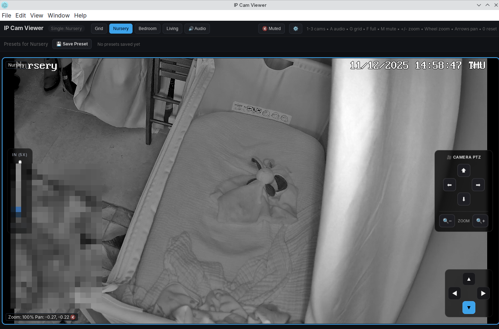

# DIY Baby Monitoring with Open Source Tech

A practical guide to building a DIY baby monitoring system using open source tools and integrating IP cameras with Home Assistant.

Authors:

- Daniel (see: raw audio, notes)
- Claude Code

> **Note:** This isn't an argument against commercial baby monitors—it's about integrating monitoring into existing smart home systems.

## Key Learnings

- **Keep it simple**: Reliable video/audio streaming beats complex AI detection
- **Ethernet over WiFi**: Reduces congestion, especially with Zigbee devices on 2.4GHz
- **RTSP support is essential**: If a camera supports RTSP, you can integrate it with almost anything
- **Fixed IPs matter**: Assign static IPs to all cameras for reliable automation

## Hardware Recommendations

### Cameras

| Camera | Notes |
|--------|-------|
| **Reolink E1 Pro** | Excellent night vision, Ethernet support, RTSP compatible. Highly recommended. |
| Tapo C210 | Budget option, but poor nighttime performance |

**Tip:** Prioritise cameras with:
- RTSP support
- Ethernet/PoE capability
- Good low-light performance

### Processing Hardware

For object detection (Frigate), you'll need decent compute power:
- **Coral TPU**: Recommended for Frigate if you can source one
- **Legacy GPUs** (e.g., Nvidia 1050): May struggle with multiple camera streams

If running on limited hardware, skip object detection and use simpler streaming solutions.

## Software Stack

### Recommended Components

| Component | Purpose |
|-----------|---------|
| **WebRTC / Restreamer** | Unified video streaming from multiple camera brands |
| **RTSP** | Universal camera protocol |
| **MQTT** | Event messaging for Home Assistant |
| **Icecast** | Reliable audio streaming server |
| **Home Assistant** | Central automation hub |

### Video Streaming

**Restreamer (WebRTC)** proved most reliable for mixed-brand setups:
- Consistent codec output regardless of source
- Low computational overhead
- Works well on legacy hardware

**Frigate** and **Scrypted** are excellent but require more compute power for object detection.

### Audio Monitoring (DIY Cry Detection)

Two approaches:

1. **Volume-based detection** (recommended for simplicity)
   - Measure baseline room noise
   - Set decibel threshold for alerts
   - Integrate with MQTT/Home Assistant

2. **Audio streaming via Icecast**
   - Extract audio from camera's RTSP stream
   - Stream to Icecast server
   - Connect via VLC on phone as a baby monitor
   - More reliable than ffmpeg direct streaming (handles client disconnects)

### Home Assistant Integration

- **Advanced Camera Card**: Great for non-PTZ cameras with digital zoom support
- **MQTT**: For audio/motion alerts
- **WebRTC**: For low-latency live viewing

## Remote Access

- **Tailscale**: Secure remote access without port forwarding
- **IP Camera Pro** (Android): Good mobile viewer when connected to tailnet

## Privacy Considerations

- Disable cloud features on cameras where possible
- For maximum privacy, choose cameras with no cloud connectivity
- Keep camera traffic on local network
- Use Tailscale for secure remote access instead of cloud services

## Protocol Notes

| Protocol | Use Case |
|----------|----------|
| **RTSP** | Universal camera input |
| **WebRTC** | Low-latency browser viewing |
| **MSE** | Good speed, browser compatible |

**Golden rule**: For low-latency local monitoring, RTSP + WebRTC restreaming gives you all the flexibility you need.

## What Didn't Work

- **Complex object detection on limited hardware**: Too computationally expensive
- **AI-based cry detection**: Too many false positives create more stress than they solve
- **WiFi-only cameras**: Network congestion issues with multiple devices

## What Worked Well

- **Simple facial detection for auto-cropping**: Just detects "face present" to focus the view
- **Volume-based cry alerts**: Simpler and more reliable than audio classification
- **Icecast audio streaming to phone**: Lightweight, reliable DIY baby monitor
- **WebRTC restreaming**: Unified interface for mixed camera brands

## Quick Start

1. Set up cameras with static IPs and RTSP enabled
2. Install Restreamer for unified video streaming
3. Set up Icecast for audio monitoring
4. Integrate with Home Assistant via MQTT
5. Use Tailscale for secure remote access

---

*Notes compiled from personal experience setting up monitoring for a newborn.*
